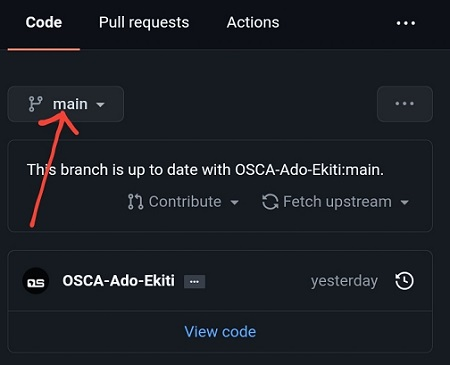
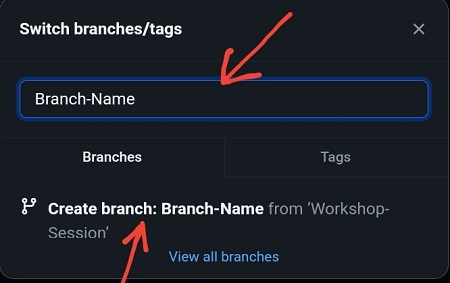
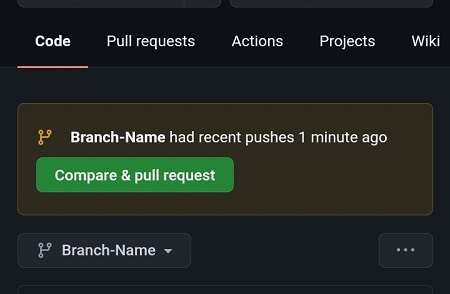
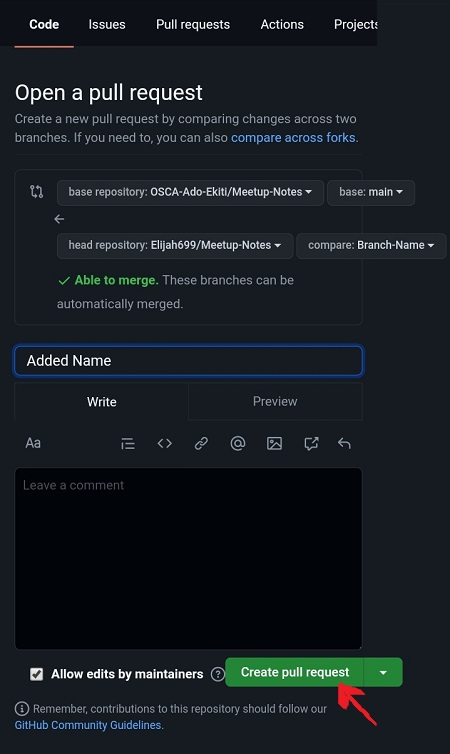

After the Open-Source Software(OSS) session at the Open Source Community Africa (OSCA) meetup on Saturday, 5th February 2022, The workshop session for Git and Github For Beginners commenced with definitions of both key terms by attendant of the the meetup before formal definitions was given by the OSCA-Ado-Ekiti Lead Salawu Abdulmalik the anchor of the session.

We learned that Git is a free, open-source version control system software used for tracking changes in any set of files, usually used for coordinating work among entities (developers, programmers or opensourcers as a whole) collaboratively developing source code during software development while Github is a provider of internet hosting service for Git repositories.

<h4>WHY IS GIT AND GITHUB IMPORTANT TO AN OPENSOURCER?</h4>

Git and Github are relevant tools an Opensourcer (a contributor to an open source project) must possess for ease of contribution to a project.

<h4>GUIDE ON MAKING CHANGES ON GIT AND GITHUB</h4>

When changes or a feature wants to be added to a project, it is advisable not to make those changes on the master/main branch. A new branch should be created for such purposes and a pull request can be created from the new branch of personal repository to the required branch of the original (upstream) repository.

<h4>PRACTICAL SESSION</h4>

We had the opportunity to practicalize the theoretical aspect of what we have learned. The exercise was to help attendant create their first pull request by adding names to the NAMES.md file in the OSCA-Ado-Ekiti/Members-Directory repository. This exercise were broken down into steps to enable every attendant participate and they are as follow:

<h5>FOR SMARTPHONE USERS:</h5>
<ol>
  <li>Create a Github account if you don't have one previously.</li>
  <li>Fork the <a href="https://github.com/OSCA-Ado-Ekiti/Members-Directory">OSCA-Ado-Ekiti/Members-Directory</a> repository. 
  </li>
  <ul>
  <li></li>
  </ul>
  <li>Create a new branch (e.g Branch-Name)
  <ul>
  <li></li>
  Next
  <li></li>
  </ul>
  </li>
  <li>Edit the NAMES.md file</li>
  <li>Add name according to the format in the <a href="https://github.com/OSCA-Ado-Ekiti/Members-Directory#readme">README.md</a>. </li>
  <li>Add commit message.</li>
  <li>Commit Changes</li>
  <li>Create a pull request from the created branch (e.g Branch-Name) to the main branch of <a href="https://github.com/OSCA-Ado-Ekiti/Members-Directory">OSCA-Ado-Ekiti/Members-Directory</a> repository on Github. 
  <ul>
  <li></li>
  Next
  <li></li>
  </ul>
  </li>
</ol>

Congratulations on your first pull request 🥂.

<h5>FOR PC USERS:</h5>

<ol>
 <li>Create a Github account if you don't have one previously.</li>
 <li>Fork the <a href="https://github.com/OSCA-Ado-Ekiti/Members-Directory">OSCA-Ado-Ekiti/Members-Directory</a> repository.
 <ul>
  <li></li>
  </ul>
 </li>
 <li>Clone the repository to your local machine</li>
 <li>Open the cloned repository folder in editor</li>
 <li>Create a new branch with <code>git checkout -b Branch-Name</code></li>
 <li>Add name according to the format in the <a href="https://github.com/OSCA-Ado-Ekiti/Members-Directory#readme">README.md</a> to the NAMES.md file.</li>
 <li>Open the terminal and confirm your directory is navigating to the Members-Directory then type <code>git add .</code> and press the Enter key</li>
 <li>Commit changes with a message with <code>git commit -m "<i>comnit message</i>"</code></li>
 <li>Push changes to Github with <code>git push origin <i>Branch-Name</i></code></li>
 <li>Create a pull request from the created branch (e.g Branch-Name) to the main branch of <a href="https://github.com/OSCA-Ado-Ekiti/Members-Directory">OSCA-Ado-Ekiti/Members-Directory</a> repository on Github. 
 <ul>
  <li></li>
  Next
  <li></li>
  </ul>
 </li>
</ol>

Congratulations on your first pull request 🥂.

